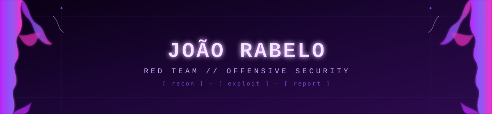

<div align="center">



[](https://github.com/rabelojp41)
[](https://www.linkedin.com/in/joao-rabelo-a30b56257/)
[](mailto:jprabelo41@gmail.com)

</div>

---


Ooooi 👋 eu sou o **Rabelo**, da área de cyber! Curto muito **JJK** e **Chainsaw Man**, e boa parte dos designs por aqui (e do meu jeito de trabalhar, sinceramente) se inspira na **Reze** — direta, imprevisível e sempre um passo à frente.

### `whoami`

Jr. Red Team Analyst na **AuditSafe**, empresa de segurança ofensiva e compliance PCI DSS. Estudante de **Defesa Cibernética** na FIAP. Trabalho na linha de frente entre pentest, hardening e compliance — testando redes, aplicações e segmentações antes que alguém mal-intencionado o faça.

<br clear="right"/>

```
> foco atual:  Pentest interno/externo (PTES) · PCI DSS v4.0.1 · Web & API Testing
> estudando:   Red Team avançado, automação ofensiva
> stack diária: Kali · Burp Suite · OWASP ZAP · Nessus · Outpost24
```

<div align="center">

| 🎯 **Red Team** | 🛡️ **Compliance** | ⚙️ **Automação** |
|:---:|:---:|:---:|
| Pentest interno/externo seguindo metodologia PTES, exploração de vulnerabilidades e testes de aplicações web/API. | Avaliações PCI DSS v4.0.1, testes de segmentação em AWS Security Groups e Azure NSGs, scans credenciados. | Scripts em Python pra geração de relatórios, automação de evidências e pipelines de documentação. |

</div>

---

### `stack.json`

<div align="center">

**Ofensiva & Pentest**


**Compliance & Scanning**


**Dev & Automação**


</div>

---

### `certifications // education`

- 🎓 **Defesa Cibernética** — FIAP (em andamento)
- 📜 **ISC2 Certified in Cybersecurity (CC)**
- 📜 **Red Hat RH124** — Red Hat System Administration I
- 📜 **Red Hat RH134** — Red Hat System Administration II

---

### `projects // no momento`

- 🕹️ **OBL1VION** — RPG de conscientização em cibersegurança em Unity, estilo Pokémon FireRed, desenvolvido para a Leroy Merlin
- 🔍 Avaliações PCI DSS v4.0.1 e testes de segmentação para múltiplos clientes na AuditSafe
- 🧪 Testes web/API com Burp Suite e OWASP ZAP em ambientes de laboratório e produção

---

<div align="center">

```
[ recon ] — [ exploit ] — [ report ] — [ repeat ]
```

<sub>construído em ambiente isolado · aprendendo em público</sub>

</div>
